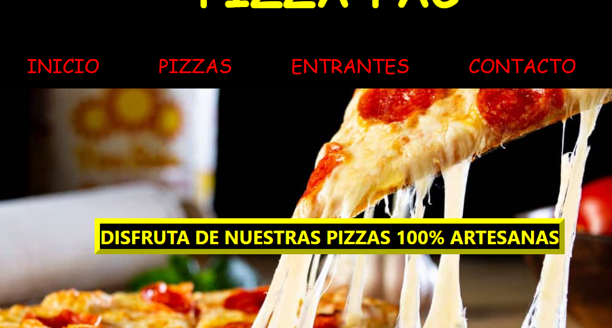
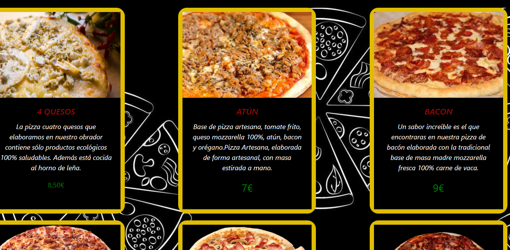
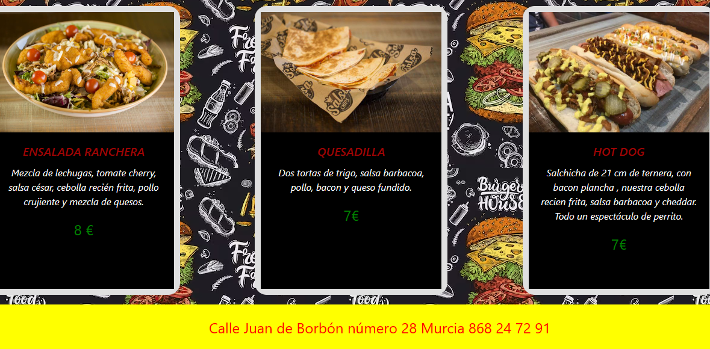
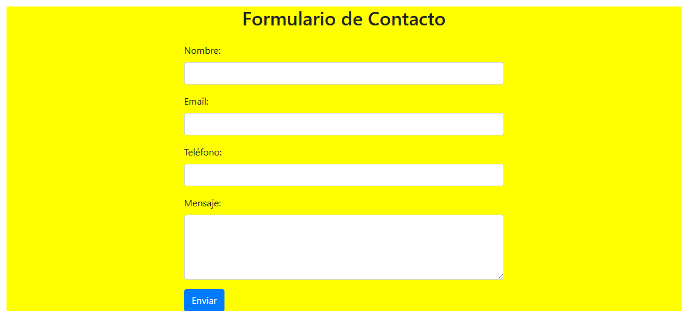

# DESCRIPCIÓN
En este proyecto diseñamos una página web de una pizzeria,la cual tiene 4 vistas.
La primera de ellas es INICIO, en la que presentamos a nuestro local con su nombre,un mensaje introductorio y una imagen de fondo.

La segunda vista es PIZZAS,en la cual tendremos los productos con su precio y descripción.

La tercera vista es la de ENTRANTES,similar a la anterior.

La cuarta y última vista es CONTACTO,en la cual tenemos información del local y un formulario que podemos rellenar.

## TECNOLOGÍAS UTILIZADAS

HTML5,CSS LAYOUT Y BOOTSTRAP.